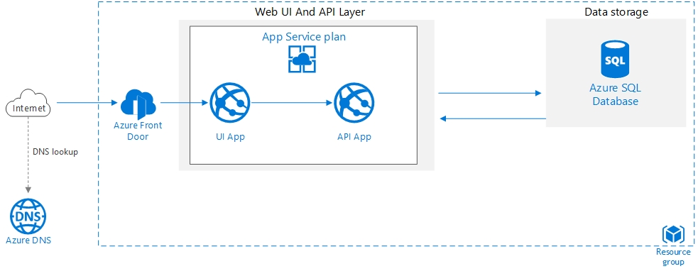
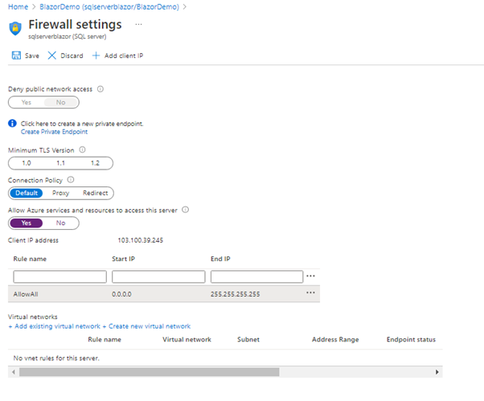
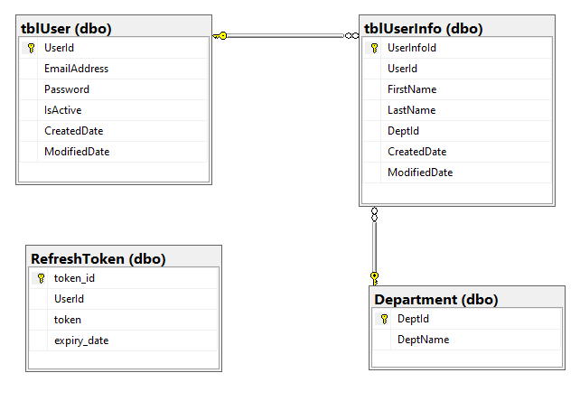
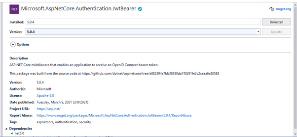
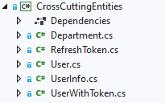
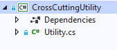

# BlazorApp
**Production-ready Blazor Application (Server)**
 
Purpose of this app to create a production-ready base template for a Web App.
 
The high-level architecture will be as below. 



In This Application we used below compnents


1. Azure App Service Plan
2. Azure Web App / App Service
   1. Application UI layer
   2. Application API layer
3. App Service logs
4. Azure Monitor Log Analytics
5. Azure Alerts
6. Azure SQL Database
7. Azure Application Insights
8. Azure SendGrid 
9. Visual Studio 2019
10. .Net Core 5
11. Blazor Framework
12. Entity Framework Core


# We divied this application in 4 parts.

1. Database
   1. Database first approch
   2. Azure SQL Database
2. API layer
   1. Asp. net Core Web API
   2. JWT Token Authentication
   3. Entity Framework Core 
3. Add CrossCutting Entities and Utility Project 
   1. CrossCuttingEntities
   2. CrossCuttingUtility
4. Web UI layer
   1. Blazor Framework
   2. Multilingual
   3. Bootstrap responsive UI 
5. Azure
   1. App Service Plan
   2. Azure Web App / App Service
   3. App Service logs
   4. Azure Monitor Log Analytics
   5. Azure Alerts
   6. Azure Application Insights
   7. Azure SendGrid
 
 #  Lets Build the application 
**Part 1**
 Since we are using db first approch, we will create database first.
 we need to create below is the database schema in Azure SQL DB, for now we will use basic Configuretion for Azure SQL DB. based on your application requirement we can go for higher ones

 

 **Note** *We need to add our development system IP in SQL server Firewall to allow the connection, for demo purpose I am allowing all the Ips but it’s not a good idea Please add only required Ips only.*
   


**DB Schema**

 

 You can refer DB script [here](Code/BlazorAppDemoUI/wwwroot/img/BlazorAppDemo-architectures.jpg)

 **Part 2**
 To connect with DB and expose as API we will use .Net Web API template

  

We will add three API controllers in API project for all three tables in DB


You can refer the code of all three [contorllers](https://github.com/AmitTyagi100/BlazorAppDemo/tree/main/Code/BlazorDemoAPI/Controllers) 

We will use JWT token for API authntication, to use JWT in API layer we will add a Nuget package.

**Microsoft.AspNetCore.Authentication.JwtBearer**



and we need to do below code change in Statrup.cs > ConfigureServices method , Configure method and add "SecretKey" in appsettings.json 
**ConfigureServices**

```c#
          var jwtSection = Configuration.GetSection("JWTSettings");
            services.Configure<JWTSettings>(jwtSection);

            //to validate the token which has been sent by clients
            var appSettings = jwtSection.Get<JWTSettings>();
            var key = Encoding.ASCII.GetBytes(appSettings.SecretKey);

            services.AddAuthentication(x =>
            {
                x.DefaultAuthenticateScheme = JwtBearerDefaults.AuthenticationScheme;
                x.DefaultChallengeScheme = JwtBearerDefaults.AuthenticationScheme;
            })
            .AddJwtBearer(x =>
            {
                x.RequireHttpsMetadata = true;
                x.SaveToken = true;
                x.TokenValidationParameters = new TokenValidationParameters
                {
                    ValidateIssuerSigningKey = true,
                    IssuerSigningKey = new SymmetricSecurityKey(key),
                    ValidateIssuer = false,
                    ValidateAudience = false,
                    ClockSkew = TimeSpan.Zero
                };
            });
```

**Configure**
```c#
        public void Configure(IApplicationBuilder app, IWebHostEnvironment env)
        {
            if (env.IsDevelopment())
            {
                app.UseDeveloperExceptionPage();
                app.UseSwagger();
                app.UseSwaggerUI(c => c.SwaggerEndpoint("/swagger/v1/swagger.json", "BlazorDemoAPI v1"));
            }

            app.UseHttpsRedirection();

            app.UseRouting();

            app.UseAuthentication();
            app.UseAuthorization();


           

            app.UseEndpoints(endpoints =>
            {
                endpoints.MapControllers();
            });
        }
```

**appsettings**

```json
"JWTSettings": {
    "SecretKey": "thisisasecretkeyForBlazorDemo"
  }
  ```

**Part 3**

Now we will add CrossCuttingEntities those will be used in both layer(i.e API layer & UI layer) 
This project will a Class library that will have all the models/entities



You can refer the code for all entities [here](https://github.com/AmitTyagi100/BlazorAppDemo/tree/main/Code/CrossCuttingEntities)

next  Cross Cutting project also be a class library "CrossCuttingUtility"
this project will have our password encription logic.




You can refer the code [here](https://github.com/AmitTyagi100/BlazorAppDemo/tree/main/Code/CrossCuttingUtility)


