# BlazorApp
**Production-ready Blazor Application (Server)**
 
Purpose of this app to create a production-ready base structure for a Web App.
 
The high-level architecture will be as below. 
 

 
In This Application, we used below components
 
 
1. Azure App Service Plan
2. Azure Web App / App Service
   1. Application UI layer
   2. Application API layer
3. App Service logs
4. Azure Monitor Log Analytics
5. Azure Alerts
6. Azure SQL Database
7. Azure SendGrid 
8. Visual Studio 2019
9. .Net Core 5
10. Blazor Framework
11. Entity Framework Core
 
 
# I divided this application into 5 parts.
 
1. **Database**
   1. Database first approach
   2. Azure SQL Database
2. **API layer**
   1. Asp. net Core Web API
   2. JWT Token Authentication
   3. Entity Framework Core 
3. **Add CrossCutting Entities and Utility Project** 
   1. CrossCuttingEntities
   2. CrossCuttingUtility
4. **Web UI layer**
   1. Blazor Framework
   2. Multilingual
   3. Bootstrap responsive UI 
5. **Azure**
   1. App Service Plan
   2. Azure Web App / App Service
   3. App Service logs
   4. Azure Monitor Log Analytics
   5. Azure Alerts
   6. Azure SendGrid
 
 #  Lets Build the application 
**Part 1**
 Since we are using DB first approach, we will create a database first.
 we need to create below is the database schema in Azure SQL DB, for now we will use basic Configuration for Azure SQL DB. based on your application requirement we can go for higher ones
 
 
 
 
 **Note**  *We need to add our development system IP in the SQL server Firewall to allow the connection, for demo purpose I am allowing all the IPs but it’s not a good idea Please add only required IPs.*
 

 
**DB Schema**
 
 
 
 You can refer DB script [here](Code/DatabaseScript/BlazorDemoAppDB.sql)
 
 **Part 2**
 To connect with DB and expose as API we will use the .Net Web API template
 
  
 
We will add three API controllers in the API project for all three tables in DB
 

 

 
You can refer the code of all three [contorllers](https://github.com/AmitTyagi100/BlazorAppDemo/tree/main/Code/BlazorDemoAPI/Controllers)
 
We will use the JWT token for API authentication, to use JWT in the API layer we will add a Nuget package.
 
**Microsoft.AspNetCore.Authentication.JwtBearer**
 

 
and we need to do below code change in Statrup.cs > ConfigureServices method , Configure method and add "SecretKey" in appsettings.json 
**ConfigureServices**
 
```c#
          var jwtSection = Configuration.GetSection("JWTSettings");
            services.Configure<JWTSettings>(jwtSection);
 
            //to validate the token which has been sent by clients
            var appSettings = jwtSection.Get<JWTSettings>();
            var key = Encoding.ASCII.GetBytes(appSettings.SecretKey);
 
            services.AddAuthentication(x =>
            {
                x.DefaultAuthenticateScheme = JwtBearerDefaults.AuthenticationScheme;
                x.DefaultChallengeScheme = JwtBearerDefaults.AuthenticationScheme;
            })
            .AddJwtBearer(x =>
            {
                x.RequireHttpsMetadata = true;
                x.SaveToken = true;
                x.TokenValidationParameters = new TokenValidationParameters
                {
                    ValidateIssuerSigningKey = true,
                    IssuerSigningKey = new SymmetricSecurityKey(key),
                    ValidateIssuer = false,
                    ValidateAudience = false,
                    ClockSkew = TimeSpan.Zero
                };
            });
```
 
**Configure**
```c#
        public void Configure(IApplicationBuilder app, IWebHostEnvironment env)
        {
            if (env.IsDevelopment())
            {
                app.UseDeveloperExceptionPage();
                app.UseSwagger();
                app.UseSwaggerUI(c => c.SwaggerEndpoint("/swagger/v1/swagger.json", "BlazorDemoAPI v1"));
            }
 
            app.UseHttpsRedirection();
 
            app.UseRouting();
 
            app.UseAuthentication();
            app.UseAuthorization();
 
 
           
 
            app.UseEndpoints(endpoints =>
            {
                endpoints.MapControllers();
            });
        }
```
 
**appsettings**
 
```json
"JWTSettings": {
    "SecretKey": "thisisasecretkeyForBlazorDemo"
  }
  ```
 
**Part 3**
 
Now we will add CrossCuttingEntities those will be used in both layer(i.e API layer & UI layer) 
This project will a Class library that will have all the models/entities
 

 
You can refer to the code for all entities [here](https://github.com/AmitTyagi100/BlazorAppDemo/tree/main/Code/CrossCuttingEntities)
 
The next  Cross-Cutting project also be a class library "CrossCuttingUtility"
this project will have our password encryption logic.
 

 
 
You can refer to the code [here](https://github.com/AmitTyagi100/BlazorAppDemo/tree/main/Code/CrossCuttingUtility)
 
**Part 4**
 
For UI Layer we will use Blazor Framework with .Net 5
 
 
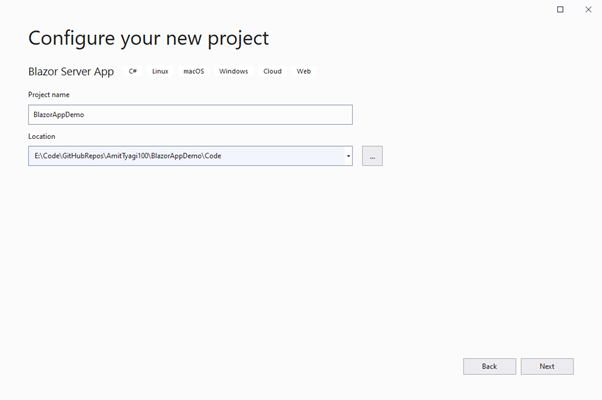
 
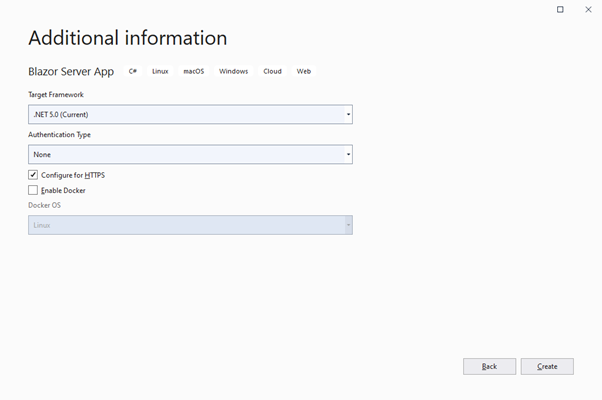
 
 
as we are going to store some data on local storage in Host.cshtml we need to change render mode to "Server"
 
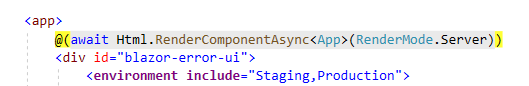
 
to use "Localization" we will add the NuGet package
 
**Microsoft.Extensions.Localization**
 
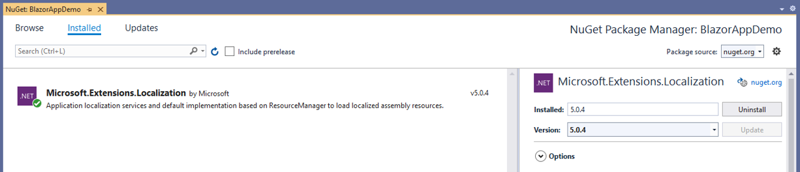
 
we need to Localization service and  controllers service  in Startup.cs > “ConfigureServices”  
```c#
    services.AddControllers();
    services.AddLocalization(Loc => Loc.ResourcesPath = "UiLocalization");
 
```
Add a new folder at the root directory in the project **“Name: UiLocalization”**
 
and we will add controller endpoint in Configure method in Startup.cs
 
```c#
    app.UseEndpoints(endpoints =>
    {
	    endpoints.MapControllers();
	    endpoints.MapBlazorHub();
	    endpoints.MapFallbackToPage("/_Host");
    });
```
Add below culture list in appsetting.json, you can add more based on your application requirement 
 ```json
 "Cultures": {
 
                "en-US": "USA",
                "fr-FR": "France"
              }
```
Add below private method (“GetCultureOptions”) in StartUp.cs file and call this in “Configure” method after “app.UseStaticFiles();
 
```c#
private RequestLocalizationOptions GetCultureOptions()
       {
           var cultures = Configuration.GetSection("Cultures")
               .GetChildren().ToDictionary(x => x.Key, x => x.Value);
 
           var supportedCultures = cultures.Keys.ToArray();
 
           var localizationOptions = new RequestLocalizationOptions()
               .AddSupportedCultures(supportedCultures)
               .AddSupportedUICultures(supportedCultures);
 
           return localizationOptions;
       }
```
Add a folder on the root with the name of “Controllers” and add “LocalizationController” in that folder as below. And add below code 
 
```c#
public IActionResult SetBrowserCulture(string culture, string redirectUri)
     {
         if (!string.IsNullOrWhiteSpace(culture))
         {
             HttpContext.Response.Cookies.Append(
                 CookieRequestCultureProvider.DefaultCookieName,
                 CookieRequestCultureProvider.MakeCookieValue(
                     new RequestCulture(culture)));
         }
 
         return LocalRedirect(redirectUri);
     }
```
 
 
Please note you may need to add Route attribute on controller 
```c# 
Route("[controller]/[action]")] 
```
 
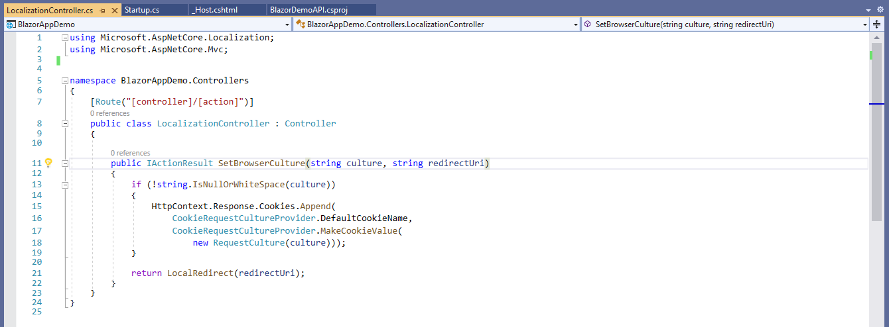
 
Add a Razor Component(SelectLanguage.razor) in Shared folder, you can refer code [here](Code/BlazorAppDemoUI/Shared/SelectLanguage.razor) 
 
Add a new resource file under the UiLocalization folder  (Name: App.resx), Please use the same name as App.resx will be the default fallback file for resources 
 
In our example, we will use only two languages so we will add two more files and we need to add language-specific text in the respective file. You can refer in source code [here](Code/BlazorAppDemoUI/UiLocalization/App.resx) 
 
Now let's use the translations in UI, we start from Menu 
Add below Inject top of the “NavMenu.razor” and change home menu text to (Home  to @Localizer["Home"])
```c#
@inject IStringLocalizer<App> Localizer
 
```

 
**Note** *We need to do the same exercise for all rozer pages and all texts, please refer to [source code](https://github.com/AmitTyagi100/BlazorAppDemo/tree/main/Code) for reference*  
 
**Tip** You can put common Using and inject statement in “_Imports.razor” file to reduce the code on individual pages
 
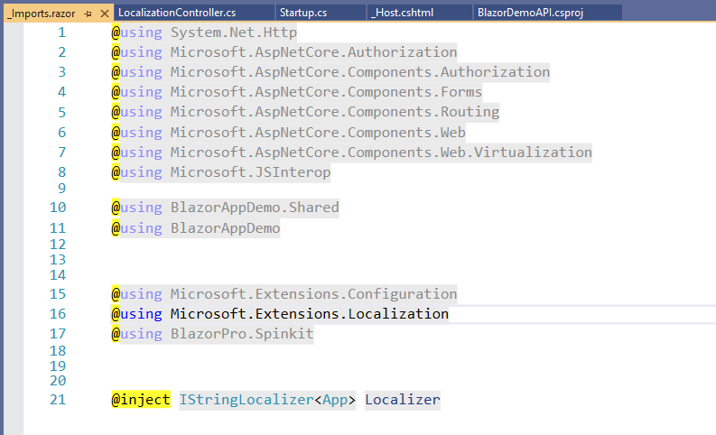
 
Now we have all the code ready to give multilingual support, we will language option in “MainLayout.razor” so it will be available on every page. 
Only we need to add “<SelectLanguage/>”  in the “MainLayout.razor” file 
 
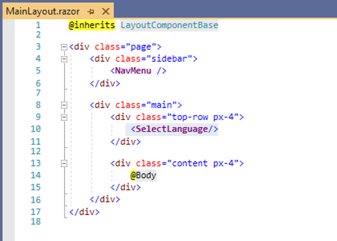
 
To run the solution we need to update solution properties to run multiple projects as per their required sequence
 
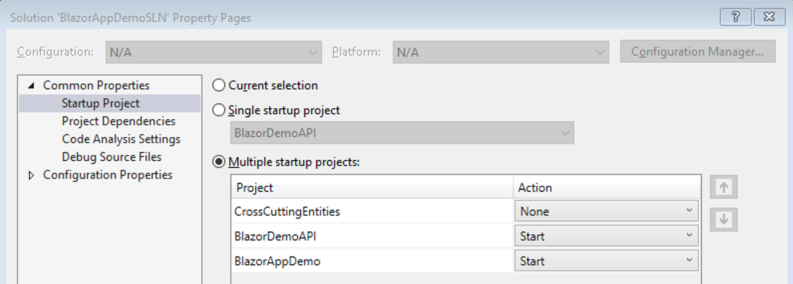
 
# Now time to see the output of this part
Click F5 button 😊
 
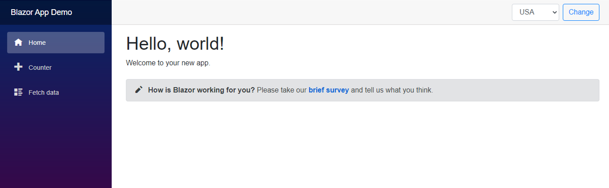
 
You can select a different language from the right top corner dropdown and click the change button
 
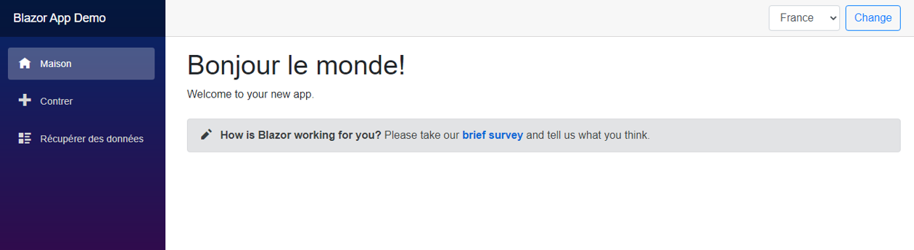
 
 
**Note** In this application I did only a few text translations but in your application, you should do translation for all the text items. 
 
We got our basic structure, now we need to add below functionalities 
 
1. Add new pages
    1. Login
    2. SignUp
    3. UserList
2. Add Razor Components
    1. CenteredCardLayout
    2. GridColumn
    3. GridView
    4. LoginLayout
    5. SelectDepartment
    6. TableTemplate
3. Add Razor Librery (to put some re useable code  )
   1. "BlazorDemoRazorLibrary"  
 
Please refer full code [here](https://github.com/AmitTyagi100/BlazorAppDemo/tree/main/Code)

**Part 5**
 
# Now we are ready to deploy our application to Azure
 
**Steps are:**
1.  Create a resource Group
    1.  You should use the same resource group that you have used for Database
2.  Create two App Services under an App Service plan
    1.  One App Service for Ui layer
    2.  2nd App Service for API Layer 
   
**Note** *If you want to expose your API layer to other 3rd parties then you should use API Management as SML layer top of your API Layer*
 
3. Configure Azure SendGrid
4. Configure Alerts, logs, Log Analytics, and application insights for both App services. 
 
**Create two Web Apps **
 

 
Publish API layer via Visual Studio
 
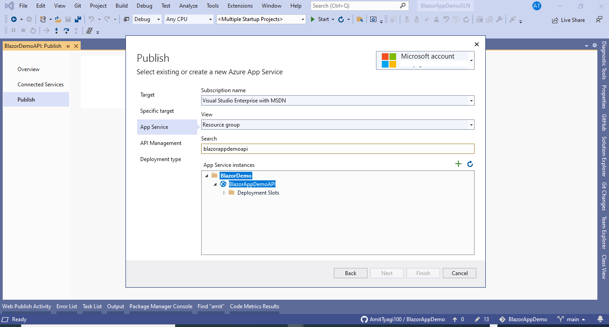
 
Skip the API Management configuration
 
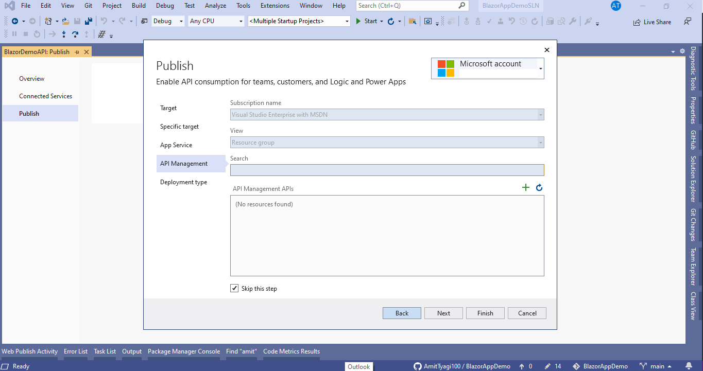
 
Publish with PubXML file 
 
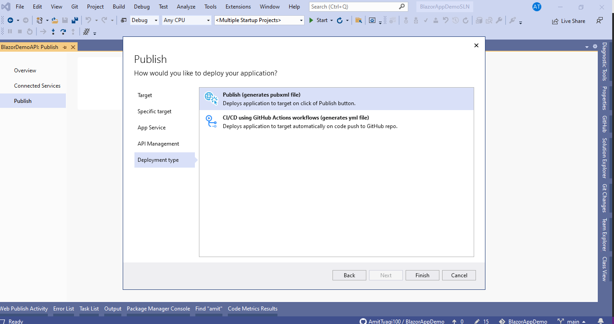
 
The next screen will be Publish Summary screen, in Last of this screen you will see the Database configuration option 
Click Configuration link
 
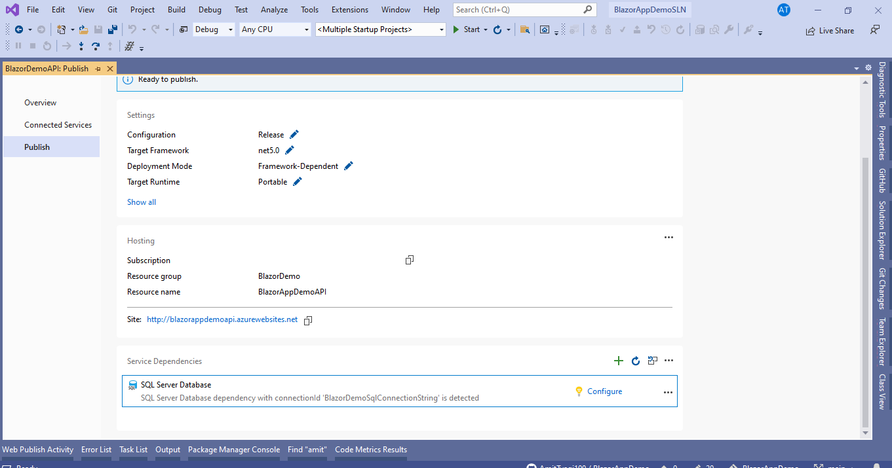
 
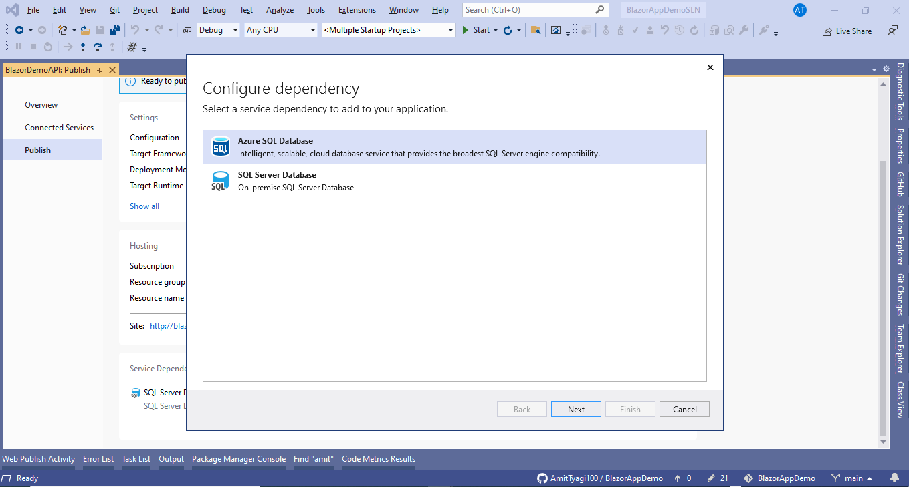
 
For Database connection string use Azure Key-Vault... In last you will see a summary screen with changes in your project. Please click Finish.
 
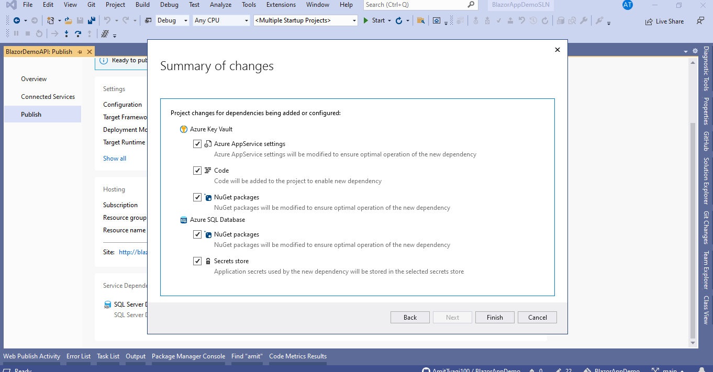
 
Similar steps will require for UI Layer except then Database setting.
 
**Note** *Please update API URL in Appsetting in UI Layer before publish*
 
# Final Output
 
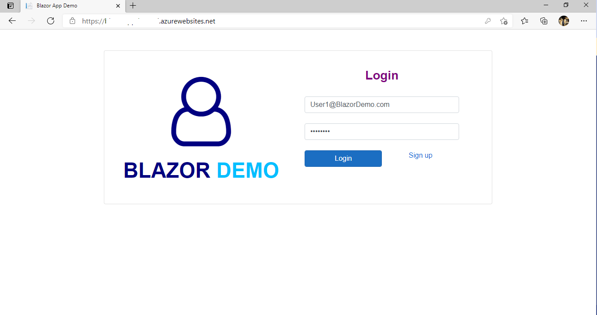
 
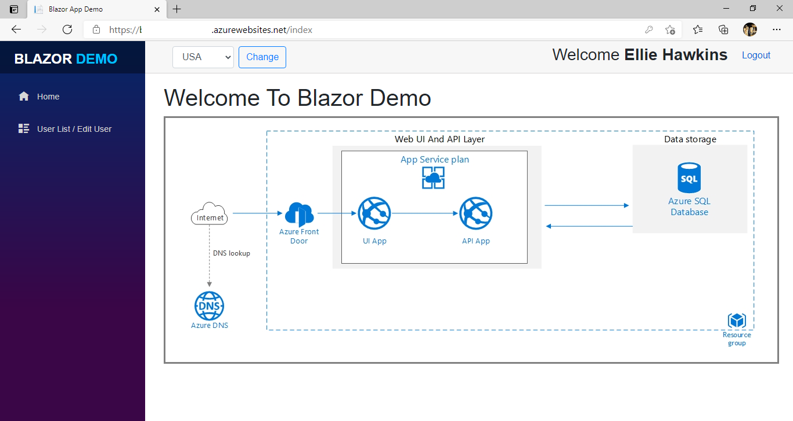
 
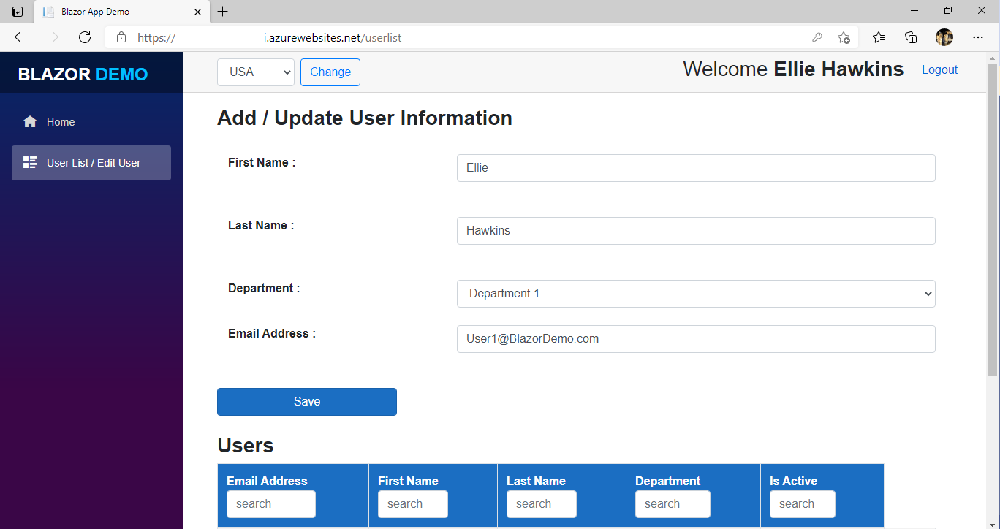
 
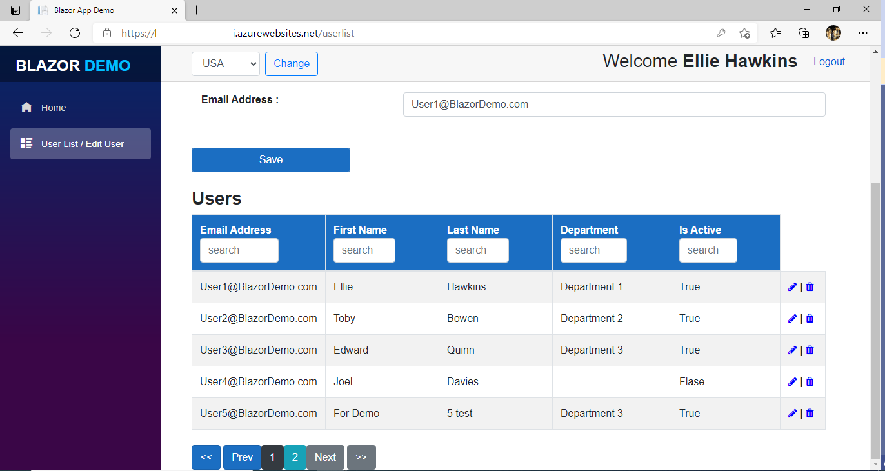
 
# Configure Azure Logs
 
 
 
 

 

 
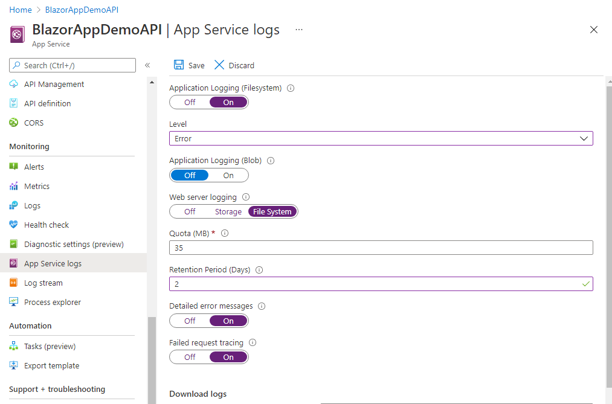
 
**We need to configure SendGrid account and add email logic on SignUp **
 
 
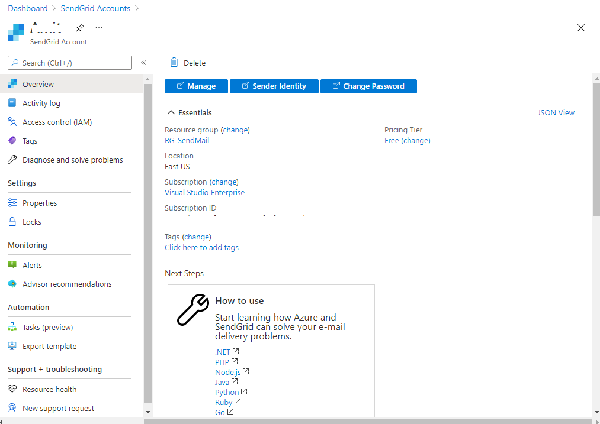
 
```c#
private async Task SendRegistrationMail(string email)
	{
 
		try
		{
 
			var apiKey = Configuration["SendGridAPIKey"];
			var client = new SendGridClient(apiKey);
			var msg = new SendGridMessage()
			{
				From = new EmailAddress("NoReply@BlazorDemoTeam.com", "Blazor Demo"),
				Subject = "Blazor Demo Team",
				PlainTextContent = "Hello, Email!",
				HtmlContent = ("<!DOCTYPE html> <html> <head> <title></title> <meta http-equiv='Content-Type' content='text/html; charset=utf-8' /> <meta name='viewport' content='width=device-width, initial-scale=1'> <meta http-equiv='X-UA-Compatible' content='IE=edge' /> <style type='text/css'> @media screen { @font-face { 	font-family: 'Lato'; 	font-style: normal; 	font-weight: 400; 	src: local('Lato Regular'), local('Lato-Regular'), url(https://fonts.gstatic.com/s/lato/v11/qIIYRU-oROkIk8vfvxw6QvesZW2xOQ-xsNqO47m55DA.woff) format('woff'); } @font-face { 	font-family: 'Lato'; 	font-style: normal; 	font-weight: 700; 	src: local('Lato Bold'), local('Lato-Bold'), url(https://fonts.gstatic.com/s/lato/v11/qdgUG4U09HnJwhYI-uK18wLUuEpTyoUstqEm5AMlJo4.woff) format('woff'); } @font-face { 	font-family: 'Lato'; 	font-style: italic; 	font-weight: 400; 	src: local('Lato Italic'), local('Lato-Italic'), url(https://fonts.gstatic.com/s/lato/v11/RYyZNoeFgb0l7W3Vu1aSWOvvDin1pK8aKteLpeZ5c0A.woff) format('woff'); } @font-face { 	font-family: 'Lato'; 	font-style: italic; 	font-weight: 700; 	src: local('Lato Bold Italic'), local('Lato-BoldItalic'), url(https://fonts.gstatic.com/s/lato/v11/HkF_qI1x_noxlxhrhMQYELO3LdcAZYWl9Si6vvxL-qU.woff) format('woff'); } } /* CLIENT-SPECIFIC STYLES */ body, table, td, a { -webkit-text-size-adjust: 100%; -ms-text-size-adjust: 100%; } table, td { mso-table-lspace: 0pt; mso-table-rspace: 0pt; } img { -ms-interpolation-mode: bicubic; } /* RESET STYLES */ img { border: 0; height: auto; line-height: 100%; outline: none; text-decoration: none; } table { border-collapse: collapse !important; } body { height: 100% !important; margin: 0 !important; padding: 0 !important; width: 100% !important; } /* iOS BLUE LINKS */ a[x-apple-data-detectors] { color: inherit !important; text-decoration: none !important; font-size: inherit !important; font-family: inherit !important; font-weight: inherit !important; line-height: inherit !important; } /* MOBILE STYLES */ @media screen and (max-width:600px) { h1 { 	font-size: 32px !important; 	line-height: 32px !important; } } /* ANDROID CENTER FIX */ div[style*='margin: 16px 0;'] { margin: 0 !important; } </style> </head> <body style='background-color: #f4f4f4; margin: 0 !important; padding: 0 !important;'> <!-- HIDDEN PREHEADER TEXT --> <div style='display: none; font-size: 1px; color: #fefefe; line-height: 1px; font-family: 'Lato', Helvetica, Arial, sans-serif; max-height: 0px; max-width: 0px; opacity: 0; overflow: hidden;'> We're thrilled to have you here! Get ready to dive into your new account. </div> <table border='0' cellpadding='0' cellspacing='0' width='100%'> <!-- LOGO --> <tr> <td bgcolor='#FFA73B' align='center'> 	<table border='0' cellpadding='0' cellspacing='0' width='100%' style='max-width: 600px;'> <tr> <td align='center' valign='top' style='padding: 40px 10px 40px 10px;'> </td> </tr> 	</table> </td> </tr> <tr> <td bgcolor='#FFA73B' align='center' style='padding: 0px 10px 0px 10px;'> 	<table border='0' cellpadding='0' cellspacing='0' width='100%' style='max-width: 600px;'> <tr> <td bgcolor='#ffffff' align='center' valign='top' style='padding: 40px 20px 20px 20px; border-radius: 4px 4px 0px 0px; color: #111111; font-family: 'Lato', Helvetica, Arial, sans-serif; font-size: 48px; font-weight: 400; letter-spacing: 4px; line-height: 48px;'> <h1 style='font-size: 48px; font-weight: 400; margin: 2;'>Welcome!</h1>  </td> </tr> 	</table> </td> </tr> <tr> <td bgcolor='#f4f4f4' align='center' style='padding: 0px 10px 0px 10px;'> 	<table border='0' cellpadding='0' cellspacing='0' width='100%' style='max-width: 600px;'> <tr> <td bgcolor='#ffffff' align='left' style='padding: 20px 30px 40px 30px; color: #666666; font-family: 'Lato', Helvetica, Arial, sans-serif; font-size: 18px; font-weight: 400; line-height: 25px;'> <p style='margin: 0;'>We're excited to have you get started. </p> </td> </tr>   <tr> <td bgcolor='#ffffff' align='left' style='padding: 0px 30px 20px 30px; color: #666666; font-family: 'Lato', Helvetica, Arial, sans-serif; font-size: 18px; font-weight: 400; line-height: 25px;'> <p style='margin: 0;'>If you have any questions, just reply to this email—we're always happy to help out.</p> </td> </tr> <tr> <td bgcolor='#ffffff' align='left' style='padding: 0px 30px 40px 30px; border-radius: 0px 0px 4px 4px; color: #666666; font-family: 'Lato', Helvetica, Arial, sans-serif; font-size: 18px; font-weight: 400; line-height: 25px;'> <p style='margin: 0;'>Cheers,<br>Blazor Demo Team</p> </td> </tr> 	</table> </td> </tr> <tr> <td bgcolor='#f4f4f4' align='center' style='padding: 30px 10px 0px 10px;'> 	<table border='0' cellpadding='0' cellspacing='0' width='100%' style='max-width: 600px;'> <tr> <td bgcolor='#FFECD1' align='center' style='padding: 30px 30px 30px 30px; border-radius: 4px 4px 4px 4px; color: #666666; font-family: 'Lato', Helvetica, Arial, sans-serif; font-size: 18px; font-weight: 400; line-height: 25px;'> <h2 style='font-size: 20px; font-weight: 400; color: #111111; margin: 0;'>Need more help?</h2> <p style='margin: 0;'><a href='#' target='_blank' style='color: #FFA73B;'>We&rsquo;re here to help you out</a></p> </td> </tr> 	</table> </td> </tr> <tr> <td bgcolor='#f4f4f4' align='center' style='padding: 0px 10px 0px 10px;'> 	<table border='0' cellpadding='0' cellspacing='0' width='100%' style='max-width: 600px;'> <tr> <td bgcolor='#f4f4f4' align='left' style='padding: 0px 30px 30px 30px; color: #666666; font-family: 'Lato', Helvetica, Arial, sans-serif; font-size: 14px; font-weight: 400; line-height: 18px;'> <br> <p style='margin: 0;'>If these emails get annoying, please feel free to <a href='#' target='_blank' style='color: #111111; font-weight: 700;'>unsubscribe</a>.</p> </td> </tr> 	</table> </td> </tr> </table> </body> </html>")
			};
			msg.AddTo(new EmailAddress(email));
 
			var response = await client.SendEmailAsync(msg);
			if (response.StatusCode != System.Net.HttpStatusCode.OK)
			{
				logger.LogError(string.Format("Error in send mail function From SendGrid, Error Details : {0} ", response.StatusCode));
			}
		}
		catch (Exception ex)
		{
			logger.LogError(string.Format("Error in send mail function, Error Details : {0} ", ex.ToString()));
 
		}
	}
```
 
 


