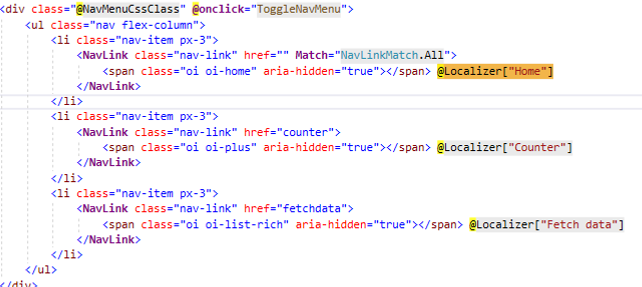

# BlazorApp
**Production-ready Blazor Application (Server)**
 
Purpose of this app to create a production-ready base template for a Web App.
 
The high-level architecture will be as below. 
 

 
In This Application, we used below components
 
 
1. Azure App Service Plan
2. Azure Web App / App Service
   1. Application UI layer
   2. Application API layer
3. App Service logs
4. Azure Monitor Log Analytics
5. Azure Alerts
6. Azure SQL Database
7. Azure Application Insights
8. Azure SendGrid 
9. Visual Studio 2019
10. .Net Core 5
11. Blazor Framework
12. Entity Framework Core
 
 
# I divided this application into 4 parts.
 
1. Database
   1. Database first approach
   2. Azure SQL Database
2. API layer
   1. Asp. net Core Web API
   2. JWT Token Authentication
   3. Entity Framework Core 
3. Add CrossCutting Entities and Utility Project 
   1. CrossCuttingEntities
   2. CrossCuttingUtility
4. Web UI layer
   1. Blazor Framework
   2. Multilingual
   3. Bootstrap responsive UI 
5. Azure
   1. App Service Plan
   2. Azure Web App / App Service
   3. App Service logs
   4. Azure Monitor Log Analytics
   5. Azure Alerts
   6. Azure Application Insights
   7. Azure SendGrid
 
 #  Lets Build the application 
**Part 1**
 Since we are using DB first approach, we will create a database first.
 we need to create below is the database schema in Azure SQL DB, for now we will use basic Configuration for Azure SQL DB. based on your application requirement we can go for higher ones
 
 
 
 
 **Note**  *We need to add our development system IP in the SQL server Firewall to allow the connection, for demo purpose I am allowing all the IPs but it’s not a good idea Please add only required IPs.*
 

 
**DB Schema**
 
 
 
 You can refer DB script [here](Code/BlazorAppDemoUI/wwwroot/img/BlazorAppDemo-architectures.jpg)
 
 **Part 2**
 To connect with DB and expose as API we will use the .Net Web API template
 
  
 
We will add three API controllers in the API project for all three tables in DB
 

 

 
You can refer the code of all three [contorllers](https://github.com/AmitTyagi100/BlazorAppDemo/tree/main/Code/BlazorDemoAPI/Controllers){:target="_blank"}
 
We will use the JWT token for API authentication, to use JWT in the API layer we will add a Nuget package.
 
**Microsoft.AspNetCore.Authentication.JwtBearer**
 

 
and we need to do below code change in Statrup.cs > ConfigureServices method , Configure method and add "SecretKey" in appsettings.json 
**ConfigureServices**
 
```c#
          var jwtSection = Configuration.GetSection("JWTSettings");
            services.Configure<JWTSettings>(jwtSection);
 
            //to validate the token which has been sent by clients
            var appSettings = jwtSection.Get<JWTSettings>();
            var key = Encoding.ASCII.GetBytes(appSettings.SecretKey);
 
            services.AddAuthentication(x =>
            {
                x.DefaultAuthenticateScheme = JwtBearerDefaults.AuthenticationScheme;
                x.DefaultChallengeScheme = JwtBearerDefaults.AuthenticationScheme;
            })
            .AddJwtBearer(x =>
            {
                x.RequireHttpsMetadata = true;
                x.SaveToken = true;
                x.TokenValidationParameters = new TokenValidationParameters
                {
                    ValidateIssuerSigningKey = true,
                    IssuerSigningKey = new SymmetricSecurityKey(key),
                    ValidateIssuer = false,
                    ValidateAudience = false,
                    ClockSkew = TimeSpan.Zero
                };
            });
```
 
**Configure**
```c#
        public void Configure(IApplicationBuilder app, IWebHostEnvironment env)
        {
            if (env.IsDevelopment())
            {
                app.UseDeveloperExceptionPage();
                app.UseSwagger();
                app.UseSwaggerUI(c => c.SwaggerEndpoint("/swagger/v1/swagger.json", "BlazorDemoAPI v1"));
            }
 
            app.UseHttpsRedirection();
 
            app.UseRouting();
 
            app.UseAuthentication();
            app.UseAuthorization();
 
 
           
 
            app.UseEndpoints(endpoints =>
            {
                endpoints.MapControllers();
            });
        }
```
 
**appsettings**
 
```json
"JWTSettings": {
    "SecretKey": "thisisasecretkeyForBlazorDemo"
  }
  ```
 
**Part 3**
 
Now we will add CrossCuttingEntities those will be used in both layer(i.e API layer & UI layer) 
This project will a Class library that will have all the models/entities
 

 
You can refer to the code for all entities [here](https://github.com/AmitTyagi100/BlazorAppDemo/tree/main/Code/CrossCuttingEntities)
 
The next  Cross-Cutting project also be a class library "CrossCuttingUtility"
this project will have our password encryption logic.
 

 
 
You can refer to the code [here](https://github.com/AmitTyagi100/BlazorAppDemo/tree/main/Code/CrossCuttingUtility)
 
**Part 4**
 
For UI Layer we will use Blazor Framework with .Net 5
 
 

 

 
 
as we are going to store some data on local storage in Host.cshtml we need to change render mode to "Server"
 

 
to use "Localization" we will add the NuGet package
 
**Microsoft.Extensions.Localization**
 

 
we need to Localization service and  controllers service  in Startup.cs > “ConfigureServices”  
```c#
    services.AddControllers();
    services.AddLocalization(Loc => Loc.ResourcesPath = "UiLocalization");
 
```
Add a new folder at the root directory in the project **“Name: UiLocalization”**
 
and we will add controller endpoint in Configure method in Startup.cs
 
```c#
    app.UseEndpoints(endpoints =>
    {
	    endpoints.MapControllers();
	    endpoints.MapBlazorHub();
	    endpoints.MapFallbackToPage("/_Host");
    });
```
Add below culture list in appsetting.json, you can add more based on your application requirement 
 ```json
 "Cultures": {
 
                "en-US": "USA",
                "fr-FR": "France"
              }
```
Add below private method (“GetCultureOptions”) in StartUp.cs file and call this in “Configure” method after “app.UseStaticFiles();
 
```c#
private RequestLocalizationOptions GetCultureOptions()
       {
           var cultures = Configuration.GetSection("Cultures")
               .GetChildren().ToDictionary(x => x.Key, x => x.Value);
 
           var supportedCultures = cultures.Keys.ToArray();
 
           var localizationOptions = new RequestLocalizationOptions()
               .AddSupportedCultures(supportedCultures)
               .AddSupportedUICultures(supportedCultures);
 
           return localizationOptions;
       }
```
Add a folder on the root with the name of “Controllers” and add “LocalizationController” in that folder as below. And add below code 
 
```c#
public IActionResult SetBrowserCulture(string culture, string redirectUri)
     {
         if (!string.IsNullOrWhiteSpace(culture))
         {
             HttpContext.Response.Cookies.Append(
                 CookieRequestCultureProvider.DefaultCookieName,
                 CookieRequestCultureProvider.MakeCookieValue(
                     new RequestCulture(culture)));
         }
 
         return LocalRedirect(redirectUri);
     }
```
 
 
Please note you may need to add Route attribute on controller 
```c# 
Route("[controller]/[action]")] 
```
 

 
Add a Razor Component(SelectLanguage.razor) in Shared folder, you can refer code [here](Code/BlazorAppDemoUI/Shared/SelectLanguage.razor) 
 
Add a new resource file under the UiLocalization folder  (Name: App.resx), Please use the same name as App.resx will be the default fallback file for resources 
 
In our example, we will use only two languages so we will add two more files and we need to add language-specific text in the respective file. You can refer in source code [here](Code/BlazorAppDemoUI/UiLocalization/App.resx) 
 
Now let's use the translations in UI, we start from Menu 
Add below Inject top of the “NavMenu.razor” and change home menu text to (Home  to @Localizer["Home"])
```c#
@inject IStringLocalizer<App> Localizer
 
```

 
**Note** *We need to do the same exercise for all rozer pages and all texts, please refer to [source code](https://github.com/AmitTyagi100/BlazorAppDemo/tree/main/Code) for reference*  
 
**Tip** You can put common Using and inject statement in “_Imports.razor” file to reduce the code on individual pages
 

 
Now we have all the code ready to give multilingual support, we will language option in “MainLayout.razor” so it will be available on every page. 
Only we need to add “<SelectLanguage/>”  in the “MainLayout.razor” file 
 

 
To run the solution we need to update solution properties to run multiple projects as per their required sequence
 

 
# Now time to see the output of this part
Click F5 button 😊
 

 
You can select a different language from the right top corner dropdown and click the change button
 

 
 
**Note** In this application I did only a few text translations but in your application, you should do translation for all the text items. 
 
We got our basic structure, now we need to add below functionalities 
 
1. Add new pages
    1. Login
    2. SignUp
    3. UserList
2. Add Razor Components
    1. CenteredCardLayout
    2. GridColumn
    3. GridView
    4. LoginLayout
    5. SelectDepartment
    6. TableTemplate
3. Add Razor Librery (to put some re useable code  )
   1. "BlazorDemoRazorLibrary"  
 
Please refer full code [here](https://github.com/AmitTyagi100/BlazorAppDemo/tree/main/Code)

**Part 5**

# Now we are ready to deploy our application to Azure

**Steps are:**
1.  Create a resource Group
    1.  You should use the same resource group that you have used for Database
2.  Create two App Services under an App Service plan
    1.  One App Service for Ui layer
    2.  2nd App Service for API Layer 
   
**Note** *If you want to expose your API layer to other 3rd parties then you should use API Management as SML layer top of your API Layer*

3. Configure Azure SendGrid
4. Configure Alerts, logs, Log Analytics, and application insights for both App services. 

**Create two Web Apps **


Publish API layer via Visual Studio


Skip the API Management configuretion


Publish with PubXML file 


Next screen will br Publish Summery screen, in Last of this screen you will see Database configuretion option 
Click Configuretion link


For Database connection string use Azure Key-Vault... In last you will see summary screen with chnages in your project. Please click Finish.


Similar steps are require for UI Layer except than Database setting.

**Note** *Please update API URL in Appsetting in UI Layer before publish*

# Final Output


